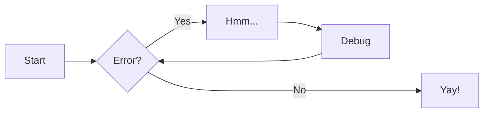

# Sample project

## Admonitions

!!! info
This is an info box.

!!! note
This is a note box.

!!! danger
This is a danger box.

!!! warning
This is a warning box.

!!! abstract
This is an abstract box.

!!! tip
This is a tip box.

!!! failure
This is a failure box.

!!! bug
This is a bug box.

!!! example
This is an example box.

!!! quote
This is a quote box.

???+ details More details
This one can be opened and closed.

## Mermaid diagrams



## Code

```python title="Hello world"
print("hello world")
```

## Tabs

=== "Java"
`java public class Thing {} `

=== "Scala"
`scala class Thing {} `

=== "Kotlin"
`kotlin class Thing `

## MathJax Math

$$
J(x) = \sum_{i=1}^n \left( \frac{1}{2} \right)^2
$$

## File hierarchy

```bash
├── docs
│ ├── about.md
│ └── index.md
├── mkdocs.yml
└── site
├── 404.html
├── about
│ └── search_index.json
├── sitemap.xml
└── sitemap.xml.gz
```
