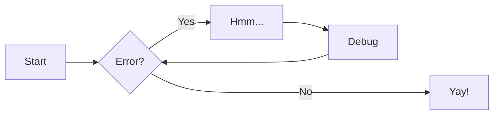

# Welcome to Sample Project Official Documentation

For full documentation visit [mkdocs.org](https://www.mkdocs.org).

## Commands

- `mkdocs serve` - Start the live-reloading docs server.
- `mkdocs build` - Build the documentation site.

!!! info
Lorem ipsum dolor sit amet, consectetur adipiscing elit. Nulla et euismod
nulla. Curabitur feugiat, tortor non consequat finibus, justo purus auctor
massa, nec semper lorem quam in massa.
sdf

## Sample layout



```bash
├── docs
│   ├── about.md
│   └── index.md
├── mkdocs.yml
└── site
    ├── 404.html
    ├── about
    │   └── search_index.json
    ├── sitemap.xml
    └── sitemap.xml.gz
```
